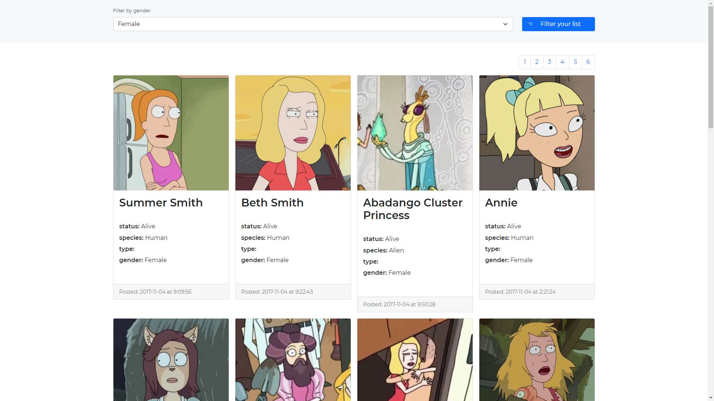

# Users List - the list of users according to gender from API
## Screenshot of website

[Demo](https://genders-list.netlify.app/)

## Our goal
The main assumption of that project is fetching data from [API](https://rickandmortyapi.com/documentation/), filter
according to the criteria (in my case is a gender filter) and creating pagination for every filter of API.

## Technology stack
This project was bootstrapped with [Create React App](https://github.com/facebook/create-react-app).
### What I've used
- [React.js with Hooks](https://reactjs.org/)
- [Sass](https://sass-lang.com/)
- [Styled-Components](https://styled-components.com/docs)
- [Axios](https://axios-http.com/)
- [React-Bootstrap](https://react-bootstrap.github.io/getting-started/introduction/)
- [React-Icons](https://react-icons.github.io/react-icons/)
- [Framer-Motion](https://www.framer.com/docs/)

## How to run?
### Available Scripts

In the project directory, you can run:

### `yarn start` or npm run start

Runs the app in the development mode.\
Open [http://localhost:3000](http://localhost:3000) to view it in the browser.

The page will reload if you make edits.\
You will also see any lint errors in the console.

### `yarn test` or npm run test

Launches the test runner in the interactive watch mode.\
See the section about [running tests](https://facebook.github.io/create-react-app/docs/running-tests) for more information.

### `yarn build` or npm run build

Builds the app for production to the `build` folder.\
It correctly bundles React in production mode and optimizes the build for the best performance.

The build is minified and the filenames include the hashes.\
Your app is ready to be deployed!

See the section about [deployment](https://facebook.github.io/create-react-app/docs/deployment) for more information.
## Deployment
This app was deployed in the [Netlify](https://app.netlify.com/)

